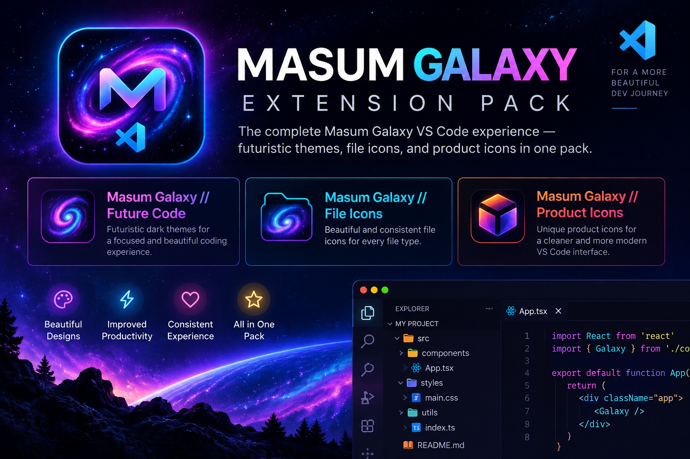

<p align="center">
  
</p>

# Masum Galaxy // Extension Pack

**One install for the complete Masum Galaxy VS Code experience.**  
Get futuristic color themes, Galaxy file icons, and custom product icons together in one pack by **Masum Billah**.

**Version 1.0.0 · Free · MIT**

## Included extensions

| Extension | What it adds |
| --- | --- |
| [**Masum Galaxy // Future Code**](https://marketplace.visualstudio.com/items?itemName=gitwithmasum.masum-galaxy-future-code) | Futuristic Galaxy, Cyber City, AI Core, Black Hole, Quantum Grid, Mars Colony, Deep Ocean, Aurora, Mecha Core, Orbital Station and Solar Flare color themes, plus optional animated workbench effects |
| [**Masum Galaxy // File Icons**](https://marketplace.visualstudio.com/items?itemName=gitwithmasum.masum-galaxy-file-icons) | Galaxy-inspired file and folder icons for web, full-stack, AI/ML, database and DevOps workflows |
| [**Masum Galaxy // Product Icons**](https://marketplace.visualstudio.com/items?itemName=gitwithmasum.masum-galaxy-product-icons) | Premium Galaxy VS Code UI/product icons with optional Aurora hover effects |

## Quick Start

1. Install **Masum Galaxy // Extension Pack**.
2. Open the Command Palette with `Ctrl + Shift + P`.
3. Choose your preferred:
   - `Preferences: Color Theme`
   - `Preferences: File Icon Theme`
   - `Preferences: Product Icon Theme`
4. For the complete look, use the Masum Galaxy theme, file icons and product icons together.

## Why use the pack?

Install one extension instead of installing the three Masum Galaxy extensions separately. Each included extension remains independently configurable, so you can mix and match the parts of the Galaxy experience you want.

## Extension IDs

```text
gitwithmasum.masum-galaxy-future-code
gitwithmasum.masum-galaxy-file-icons
gitwithmasum.masum-galaxy-product-icons
```

## Optional effects note

The core themes and icon themes work normally after installation. Optional Aurora/custom CSS hover effects may require additional desktop-side setup and are not required to use this Extension Pack.

## Local development

```powershell
git clone https://github.com/gitwithmasum/Masum-Galaxy-Extension-Pack.git
cd Masum-Galaxy-Extension-Pack

npm.cmd install
npx.cmd vsce package
```

This creates:

```text
masum-galaxy-extension-pack-1.0.0.vsix
```

Install the local VSIX with:

```powershell
code --install-extension .\masum-galaxy-extension-pack-1.0.0.vsix --force
```

## Included projects

- [Masum Galaxy // Future Code](https://github.com/gitwithmasum/Galaxy-VS-Code-Themes)
- [Masum Galaxy // File Icons](https://github.com/gitwithmasum/Galaxy-VS-Code-File-Icon)
- [Masum Galaxy // Product Icons](https://github.com/gitwithmasum/Galaxy-VS-Code-Product-Icon)

## Branding

- Marketplace icon: `images/icon.png`
- Hero banner: `images/marketplace-hero.png`

## License

MIT
